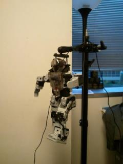
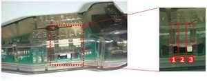

# BioloidController

Controlling Bioloid robotic controller and dynamixels from PC (created May 20, 2012)

This is the older code created to control Bioloid dynamixels via CM-510 or CM-5 controller from PC. Use it only as a code sample at your risk. 
I was able to control this humanoid robot:

This setup: PC<->USB2Dynamixel<->CM-510<->Dynamixels was not supported by Dynamixel SDK back in the day, therefore I had to create this API.

To control Bioloid from PC you need to (these instructions used to work back when I coded it up, not sure if it works today):

1) Use USB2Dynamixel or other USB to Serial connector to connect CM-510 (or CM-5) controller via a serial cable to PC’s USB port. 
If you have USB2Dynamixel, then you have to switch it to RS232 mode (position #3)

2) USB2Dynamixel appears as COM3 port on your PC. On Windows, you have to open this port’s properties (in devices) and 
go to “Advanced” settings and set “Latency Timer” to 1 (msec) as described [here](http://support.robotis.com/en/software/dynamixel_sdk/usb2dynamixel/usb2dxl_windows.htm)

3) Power up your CM-510 (or CM-5). The “manage” mode indicator should start blinking. 
Press the “Start” button to start the “managed mode”. The indicator next to “manage” title should light up. 
If you skip this step, Bioloid’s controller is not going to be in the right state for controlling from PC.

4) Now, the Bioloid controller (CM-510 or CM-5) needs to be switched to the “Toss mode“. 
In this mode, CM-510 firmware works as a bridge and forwards all commands it receives from PC to Dynamixels connected to it and 
also forwards all Dynamixel responses back to PC. This mode is not documented by Robotis by some reason. 
To switch to it you need to send “t\r” (‘t’ + 0x0D sequence) from your C/C++ program via a serial port to CM-510. 
See SendTossModeCommand() function that does it in the C++ code below.

5) After that, you can create Dynamixel protocol commands and send them to CM-510 via the serial port. 
Make sure that the program initializes the COM port communication speed at 57600, since this is the max speed that CM-5 and CM-510 support. 
See C++ code below for details.

NOTES: 
- I found that on some PCs this process was not enough. After powering your Bioloid, you need to run RoboPlus Manager from Robotis and connect the app to your Bioloid 
(press “connect” button) before controlling it from your PC program. The RoboPlus Manager does some non documented communication and the “Toss mode” can be initialized 
only after that (this used to be the case, it might work as is now)
- “Toss mode” cannot be turned OFF (at least I don’t know how at the moment) and to turn it off you need to turn your Bioloid power OFF.

This project was created with VS 2010 on Windows. All Bioloid code is in BioloidAPI.cpp.
